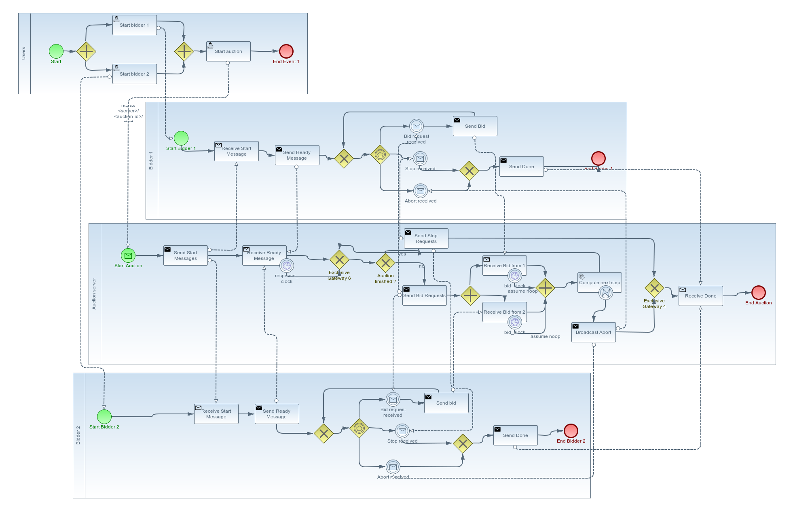

General Auction System in Python (GASP)
==================================================

The General Auction System in Python (GASP) aims at running different types of auctions. It also contains a system dedicated to running competitions between automatic bidders.

The model is (partly) based on the following paper:

> 	Mittelmann, Munyque, Bouveret, Sylvain et Perrussel, Laurent (2022). **Representing and reasoning about auctions**. In *Auton. Agents Multi Agent Syst.*, 36(1): 20.

License
-------

Gasp is released under the [General Public License, version 3](./LICENSE).

Getting Started
---------------

After downloading the code, the first thing you will have to do to make it work is to install the necessary libraries. We strongly advise you to use a virtual environment (like [venv](https://docs.python.org/3/library/venv.html#module-venv)) to manage dependencies for the project.

For instance, if you want to use venv, you can proceed as follows:

```console
$ python3 -m venv venv
$ . venv/bin/activate
```

Once venv is activated, you can install the necessary libraries as follows:

```console
$ pip3 install -r requirements.txt
```

### Installing and configuring the database

The auction server relies on a Postgres database to store persistent information about the competitions. Here is how you can proceed to set up
the postgres database (assuming Postgres server and client are already installed on your system).

1. First, connect as root: ``sudo -s``
2. Then run Postgres client as postgres user: ``su -u postgres psql``
3. When you are connected, you can create a DB user using the following
SQL command:

```sql
CREATE USER gasp WITH ENCRYPTED PASSWORD '*********';
```

4. Then you can create the database using the following SQL command:

```sql
CREATE DATABASE gasp OWNER gasp;
```

### Configuring the Flask application

The first thing you have to do to configure the application is to set up the connection parameters to the database. To do that:

1. Copy `gasp_server/config_template.py` to `gasp_server/config.py`
2. Open `gasp_server/config.py` and replace the values for `DBHOST`, `DBNAME`, `DBUSER` and `DBPASSWORD` with the values that match your configuration parameters.
3. Then, set the `FLASK_APP` and `FLASK_DEBUG` environment variables as follows:

```shell
export FLASK_APP="gasp_server"
export FLASK_DEBUG=True
```

> **Note:** For these environment variables to be automatically set when
> you start working with your application, you can simply append the latter
> two lines to the file `venv/bin/activate`


### Initializing the database

Once everything is set up correctly, you can initialize the database using the flask command `init-db`:

```console
$ flask init-db
```


### Starting the server

Everything is ready. You can start the server as follows:

```console
$ flask run
```

The server should start with no error. To test if everything is working correctly, you can send the following HTTP request:

```http
GET http://127.0.0.1:5000/competitions HTTP/1.1
```

(assuming that you left the default Flask parameters)

You should receive a response that looks like the following one:

```http
HTTP/1.1 200 OK
Server: Werkzeug/2.2.2 Python/3.10.7
Date: Thu, 09 Mar 2023 16:27:26 GMT
Content-Type: application/json
Content-Length: 3
Connection: close

[]
```

This is the competition list of the server (in JSON). Initially, this list is empty.


Detailed content
---------------

### Core

The `core` module contains the auction handling engine, notably the model and all the classes needed to run an auction. It also contains a set of specific auctions:

- Simultaneous Ascending Auction


The `core` module also contains a test program that runs a shell and simulates Simultaneous Ascending Auctions in the shell. You can launch it as follows:

```console
$ core/saa_shell.py
```

This shell accepts the following commands: `bid`, `new`, `next`, `show`, `state` and `bye`.

At start, no auction is running. A new auction can be created using `new`:

```console
(SAA) new 4 5 2 3
```

The latter command creates an auction with 4 bidders, 5 goods, starting price 2 and increment 3.

Then, agents can bid using the `bid` keyword:

```console
(SAA) bid 0 1
Bid accepted
```

The latter command informs the simulator that the first bidder wants to bid for the 2nd good (bidder and good indices start at 0).

Once everyone has finished bidding, the next auction stage can be computed using the `next` command.

At any time, we can see the auction state using either `show` or `state`.

### Auction server and bidders

The `gasp_server` module contains the competition server engine. It relies on Flask to serve HTTP content. A precise description of the protocol is given in the [GASP Exchange Protocol section below](#gasp-exchange-protocol).

As explained in the [Getting started section](#getting-started), the server can be launched as follows:

```console
$ flask run
```

A new sample auction can be created using the `auction_starter.py` script:

```console
$ gunicorn -k eventlet tools.auction_manager:app --bind localhost:9000
```

When run, this script contacts the server and asks for the creation of a new competition, using the description contained in `tools/saa_auction.json`. The server answers with a message containing the URL of this competition.

To check that the competition has been successfully created, you can ask the server for its complete description in JSON using an HTTP request:

```http
GET http://localhost:5000/c3329eee-dda9-472c-8923-e8061a2581e6 HTTP/1.1
```

(Of course, you will have to replace the UUID in the request above with your own UUID)

Now if you want to test the full running of the newly created auction, you can use the provided truthful bidder implementation for Simultaneous Ascending Auctions. Assuming the server is still running, open a new terminal, and launch the script `gunicorn -k eventlet bidders.artificial_bidder:app --bind localhost:8080` for artificial bidders or `gunicorn -k eventlet bidders.human_bidder:app --bind localhost:38400`:

```console
$ gunicorn -k eventlet bidders.artificial_bidder:app --bind localhost:8080
$gunicorn -k eventlet bidders.human_bidder:app --bind localhost:38400
```

A message stating that the server is running should be printed (NB: yes, the bidders are also implemented as web servers, for they must be able to respond to the auction server requests).

Then, start the auction sending filling the form in http://localhost:9000.

The auction server should answer with a message stating that the competition is started. Then, the auction server and the bidders interact automatically until the auction terminates.

The `bidders` module also contains a comprehensive test script that aims at fully testing the protocol running simultaneous ascending auctions. Concretely, this script runs $n$ tests (by default, $n=10$) in a row. For each test, it creates a new competition with random parameters, starts it, and simulates truthful bidders until the auction terminates. When the auction terminates, the test program computes the expected auction result, and compares it with the result provided with the server. They should match.

## GASP Exchange Protocol

Now we will dive a little bit more into the protocol details. A simplified synthesis of the process of running an auction is described in the picture below, representing an auction with two bidders:



All the process is based on HTTP exchanges. We will give the detail of all the messages exchanged, assuming we run a simultaneous ascending auction.

### Creating a competition

To create a competition, one has to send a `POST` request to the url `<auction-server>/competitions`. The request should contain the description of the auction is JSON format. Here is a self-explaining example of such request:

```http
POST http://localhost:5000/competitions HTTP/1.1
content-type: application/json

{
    "competition_id": "competition123",
    "title": "lorem ipsum",
    "description": "lorem ipsum",
    "starts": "2021-10-25T18:25:43.511Z",
    "response_clock": 10,
    "bid_clock": 10,
    "mechanism": "SAA",
    "start_price": 3,
    "increment": 2,
    "goods": ["Good1", "Good2", "Good3", "Good4"],
    "agents": [
        {
            "id": "agent1",
            "url": "http://localhost:38400/bidder1",
            "valuation": {
                "node": "ic",
                "value": 0,
                "min": 0,
                "max": 4,
                "child_nodes": [
                    {
                        "node": "leaf",
                        "value": 8,
                        "units": 1,
                        "good": "Good1"
                    },
                    {
                        "node": "leaf",
                        "value": 6,
                        "units": 1,
                        "good": "Good2"
                    },
                    {
                        "node": "leaf",
                        "value": 15,
                        "units": 1,
                        "good": "Good3"
                    },
                    {
                        "node": "leaf",
                        "value": 12,
                        "units": 1,
                        "good": "Good4"
                    }
                ]
            },
            "allocation": {
                "Good1": 0,
                "Good2": 0,
                "Good3": 0,
                "Good4": 0
            },
            "budget": 44
        },
        {
            "id": "agent2",
            "url": "http://localhost:38400/bidder2",
            "valuation": {
                "node": "ic",
                "value": 0,
                "min": 0,
                "max": 4,
                "child_nodes": [
                    {
                        "node": "leaf",
                        "value": 3,
                        "units": 1,
                        "good": "Good1"
                    },
                    {
                        "node": "leaf",
                        "value": 22,
                        "units": 1,
                        "good": "Good2"
                    },
                    {
                        "node": "leaf",
                        "value": 6,
                        "units": 1,
                        "good": "Good3"
                    },
                    {
                        "node": "leaf",
                        "value": 7,
                        "units": 1,
                        "good": "Good4"
                    }
                ]
            },
            "allocation": {
                "Good1": 0,
                "Good2": 0,
                "Good3": 0,
                "Good4": 0
            },
            "budget": 34
        }
    ]
}
```

Upon receiving this request, the server should answer with a message stating that the competition has been created:

```http
HTTP/1.1 200 OK
Server: Werkzeug/2.2.2 Python/3.10.7
Date: Fri, 10 Mar 2023 10:08:56 GMT
Content-Type: application/json
Content-Length: 110
Connection: close

{
  "message": "Competition created",
  "url": "http://localhost:5000/90379460-7e9f-49d7-987d-60ddf6f0ecd7"
}
```

### Starting a competition

To start a previously created competition, use the following request (as already seen [above](#auction-server-and-bidders)).

```http
GET http://localhost:5000/90379460-7e9f-49d7-987d-60ddf6f0ecd7/start HTTP/1.1
```

The expected response is:

```http
HTTP/1.1 200 OK
Server: Werkzeug/2.2.2 Python/3.10.7
Date: Fri, 10 Mar 2023 10:13:04 GMT
Content-Type: application/json
Content-Length: 39
Connection: close

{
  "message": "Competition started"
}
```

### Running a competition

#### First step: starting the competion

Upon receiving a start message, the auction server immediately sends start messages to all agents:

```http
POST http://localhost:38400/bidder1 HTTP/1.1
content-type: application/json

{
    "message_type": "start",
    "agent_id": "agent1",
    "competition_id": "90379460-7e9f-49d7-987d-60ddf6f0ecd7",
    "mechanism": "SAA",
    "url": "http://localhost:5000/90379460-7e9f-49d7-987d-60ddf6f0ecd7",
    "response_clock": 10,
    "bid_clock": 10,
    "goods": ["Good1", "Good2", "Good3", "Good4"],
    "valuation": {
        "node": "ic",
        "value": 0,
        "min": 0,
        "max": 4,
        "child_nodes": [
            {"node": "leaf", "value": 8, "units": 1, "good": "Good1"},
            {"node": "leaf", "value": 6, "units": 1, "good": "Good2"},
            {"node": "leaf", "value": 15, "units": 1, "good": "Good3"},
            {"node": "leaf", "value": 12, "units": 1, "good": "Good4"}
        ]
    }
}
```

The bidders should answer with:

```json
{"response": "ready"}
```

within `response_clock` seconds. If any bidder does not answer before the timeout, the auction server assumes it is ready.


#### Main bidding loop

When all the bidders are ready (or assumed to be), the auction server sends a bid request message to all of them. This bid request message contains various information about the auction state:

```http
POST http://localhost:38400/bidder1 HTTP/1.1
content-type: application/json

{
    "message_type": "bid_request",
    "agent_id": "agent1",
    "competition_id": "90379460-7e9f-49d7-987d-60ddf6f0ecd7",
    "auction_state": {
        "joint_trade": {"agent1": {}, "agent2": {}},
        "joint_allocation": {"agent1": {}, "agent2": {}},
        "joint_payment": {},
        "propositions": {"terminated": false, "price": 3, "start_price": 3, "increment": 2, "sold_prices": [null, null, null, null], "sold": [false, false, false, false]}
    }
}
```

The bidders should answer with:

```json
{"response": "received"}
```

Then, each bidder computes its own bid, and submits it as a `POST` request to `<auction-server>/<competition-id>/<agent-id>/bid`. For instance:

```http
POST http://localhost:5000/90379460-7e9f-49d7-987d-60ddf6f0ecd7/agent1/bid HTTP/1.1
content-type: application/json

{
    "message_type": "bid",
    "competition_id": "90379460-7e9f-49d7-987d-60ddf6f0ecd7",
    "agent_id": "agent1",
    "bid": ["Good2", "Good4"]
}
```

The auction server answers with:

```json
{"message": "Bid submitted"}
```

If the bid submitted by an agent is incorrect or sent after `bid_clock` seconds have elapsed, then the auction server assumes the bidder bids `noop` and proceeds.

When all the bids have been submitted (or the timeout is reached), the auction server computes the next state of the auction. If the auction is not terminated, it restarts the bid request phase and does so until the auction terminates.

#### Last step: end of the auction

When the auction terminates, the auction server broadcasts to all the agents a `stop` message containing all the information about the auction (final) state.

```http
POST http://localhost:38400/bidder1 HTTP/1.1
content-type: application/json

{
    "message_type": "stop",
    "agent_id": "agent1",
    "competition_id": "90379460-7e9f-49d7-987d-60ddf6f0ecd7"
    "auction_state": {
        "joint_trade": {
            "agent1": {"Good1": 1, "Good3": 1, "Good4": 1},
            "agent2": {"Good2": 1}
        },
        "joint_allocation": {
            "agent1": {"Good1": 1, "Good3": 1, "Good4": 1},
            "agent2": {"Good2": 1}
        },
        "joint_payment": {"agent1": 21, "agent2": 7},
        "propositions": {
            "terminated": true,
            "price": 11,
            "start_price": 3,
            "increment": 2,
            "sold_prices": [5, 7, 7, 9],
            "sold": [true, true, true, true]
        }
    }
}
```

Any polite enough bidder should then answer with:

```json
{"response": "done"}
```

although this has no incidence on the auction server.

#### Aborting an auction

At any moment, if there is a problem, the auction server can send a message of type `abort`. In that case, the auction terminates immediately. Here is an example of such a message:

```json
{
    "message_type": "abort",
    "competition_id": "90379460-7e9f-49d7-987d-60ddf6f0ecd7",
    "agent_id": "agent1"
}
```

It may happen for instance if one of the bidders is completely unreachable.
#agape

# agape
